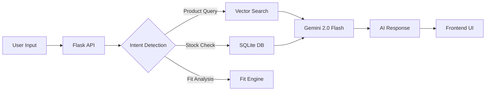

# 🔥 Phoenix AI — Smart Retail Concierge

<div align="center">


[](https://python.org)
[](https://flask.palletsprojects.com)
[](https://ai.google.dev)
[](LICENSE)

**An AI-powered luxury retail shopping assistant with real-time Gemini intelligence, virtual try-on, semantic product search, and a premium mobile-first UI.**

[Features](#-features) • [Demo](#-demo) • [Quick Start](#-quick-start) • [Architecture](#-architecture) • [API Reference](#-api-reference) • [Tech Stack](#-tech-stack)

</div>

---

## ✨ Features

### 🧠 AI-Powered Concierge (Gemini 2.0 Flash)
- **Real-time conversational AI** — Powered by Google's Gemini 2.0 Flash model
- **Multi-turn memory** — Maintains conversation context across messages
- **Product-aware responses** — Semantic search results injected into AI context
- **Calendar-smart recommendations** — Personalizes suggestions based on upcoming events

### 👗 Virtual Try-On System
- **AI body model selection** — Choose from 4 body types (Taylor/S, Jordan/M, Morgan/L, Alex/XL)
- **Garment overlay engine** — Drag, scale, and position clothing on models
- **Fit analysis scoring** — AI-generated fit diagnostics with tailoring recommendations
- **Photo editing suite** — Brightness, contrast, saturation, blur, and ambient filters

### 🔍 Smart Product Discovery
- **Semantic vector search** — TF-IDF powered natural language product matching
- **Curated outfit recommendations** — AI pairs complementary items automatically
- **Live inventory tracking** — Real-time stock levels across 3 store locations
- **Interactive store locator** — Distance-based store map with stock availability

### 🛒 Complete Shopping Flow
- **Smart shopping bag** — Add, remove, quantity management with live totals
- **Secure checkout** — Multiple payment methods (Visa, Apple Pay)
- **Delivery intelligence** — AI recommends pickup vs. shipping based on calendar
- **Digital receipts** — QR-code enabled order confirmations

### 🏪 Smart Fitting Room
- **Time slot booking** — Reserve private fitting rooms at flagship stores
- **Auto-populated items** — AI pre-loads your try-on selections
- **Stylist insights** — Complementary accessory suggestions

### 🔐 Authentication System
- **Phoenix-branded portal** — Animated SVG logo with dual Sign In/Sign Up tabs
- **User registration** — Secure account creation with profile management
- **Session persistence** — Profile sync across all app screens

---

## 🖥️ Demo

### Dashboard Overview
The app features a split-panel design: an AI chat concierge on the left and a phone simulator on the right displaying the full shopping experience.

### Key Screens

| Screen | Description |
|--------|-------------|
| 🛍️ **Shopping Bag** | Premium product cards with color/size selectors |
| 💬 **AI Chat** | Real-time Gemini-powered fashion advice |
| 📍 **Store Locator** | Live inventory map with stock levels |
| 👔 **Virtual Try-On** | AI body model garment overlay system |
| 💳 **Checkout** | Secure payment with delivery intelligence |
| 🏪 **Fitting Room** | Smart reservation with time slot booking |
| 🔐 **Auth Portal** | Phoenix-branded login/signup experience |

---

## 🚀 Quick Start

### Prerequisites
- **Python 3.11+**
- **pip** (Python package manager)
- **Gemini API Key** — Get free at [aistudio.google.com/apikey](https://aistudio.google.com/apikey)

### Installation

```bash
# 1. Clone the repository
git clone https://github.com/srujan1-creator/Smart-Retail-concierge-AI.git
cd Smart-Retail-concierge-AI

# 2. Install dependencies
pip install flask google-genai

# 3. Configure your Gemini API key
echo "GEMINI_API_KEY=your_api_key_here" > .env

# 4. Initialize the database
python database.py

# 5. Launch the app
python app.py
```

### 🌐 Open in Browser
```
http://localhost:5000
```

---

## 🏗️ Architecture

```
Smart-Retail-Concierge-AI/
│
├── app.py                  # Flask server + Gemini AI integration + API routes
├── database.py             # SQLite schema + seed data (products, inventory, users)
├── vector_search.py        # TF-IDF semantic search engine for products
├── test_app.py             # Unit tests (9 tests covering all endpoints)
├── .env                    # Gemini API key (not committed)
├── .gitignore              # Git ignore rules
│
├── templates/
│   └── index.html          # Single-page app with all screens + Phoenix auth portal
│
└── static/
    ├── css/
    │   └── style.css       # Complete design system (1900+ lines)
    ├── js/
    │   └── app.js          # Client-side logic, state management, UI interactions
    └── images/
        ├── products/       # Product photography (9 items)
        └── models/         # AI body model images (4 body types × multiple garments)
```

### Data Flow



---

## 📡 API Reference

| Endpoint | Method | Description |
|----------|--------|-------------|
| `/` | GET | Main application page |
| `/api/chat` | POST | AI chat — sends message to Gemini with product context |
| `/api/profile` | GET/POST | User profile management |
| `/api/login` | POST | User authentication |
| `/api/register` | POST | New user registration |
| `/api/products` | GET | Full product catalog |
| `/api/inventory/<id>` | GET | Live stock levels for a product |
| `/api/checkout` | POST | Process order and generate receipt |
| `/api/reserve` | POST | Book fitting room time slot |

### Chat API Example

```bash
curl -X POST http://localhost:5000/api/chat \
  -H "Content-Type: application/json" \
  -d '{"message": "What should I wear to a cocktail party?"}'
```

**Response:**
```json
{
  "message": "For a cocktail party, I'd recommend our **Aura Silk Wrap Dress** ($345) in Emerald...",
  "action": "recommend_products",
  "products": [9, 8],
  "screen": "bag"
}
```

---

## 🛠️ Tech Stack

| Layer | Technology |
|-------|-----------|
| **AI Engine** | Google Gemini 2.0 Flash |
| **Backend** | Python 3.11, Flask |
| **Database** | SQLite3 |
| **Search** | TF-IDF Vector Search (custom) |
| **Frontend** | Vanilla HTML5, CSS3, JavaScript ES6+ |
| **Typography** | Google Fonts (Inter, Outfit, Playfair Display) |
| **Design** | Glassmorphism, dark mode, micro-animations |
| **Auth** | Session-based with SQLite user store |

---

## 🧪 Testing

```bash
# Run all 9 unit tests
python test_app.py
```

Tests cover:
- ✅ Home page rendering
- ✅ Product catalog API
- ✅ Inventory lookup
- ✅ Chat AI responses
- ✅ User login/authentication
- ✅ User registration
- ✅ Checkout flow
- ✅ Fitting room reservation
- ✅ Profile management

---

## 📦 Product Catalog

| # | Product | Price | Category |
|---|---------|-------|----------|
| 1 | Essential Wool Blazer | $495 | Outerwear |
| 2 | Luxury Poplin Shirt | $145 | Shirts |
| 3 | Tech-Stretch Chinos | $195 | Pants |
| 4 | Artisan Leather Chelsea Boots | $385 | Footwear |
| 5 | Premium Merino Polo | $125 | Tops |
| 6 | Silk Pocket Square | $65 | Accessories |
| 7 | Tailored Blazer | $545 | Outerwear |
| 8 | Contemporary Cut-Out Dress | $295 | Dresses |
| 9 | Aura Silk Wrap Dress | $345 | Dresses |

---

## 🔑 Environment Variables

| Variable | Description | Required |
|----------|-------------|----------|
| `GEMINI_API_KEY` | Google Gemini API key | Yes |

Create a `.env` file in the project root:
```env
GEMINI_API_KEY=your_api_key_here
```

---

## 🤝 Contributing

1. Fork the repository
2. Create your feature branch (`git checkout -b feature/amazing-feature`)
3. Commit your changes (`git commit -m 'Add amazing feature'`)
4. Push to the branch (`git push origin feature/amazing-feature`)
5. Open a Pull Request

---

## 📄 License

This project is licensed under the MIT License — see the [LICENSE](LICENSE) file for details.

---

<div align="center">

**Built with ❤️ and 🔥 Phoenix AI**

*Powered by Google Gemini 2.0 Flash*

</div>
